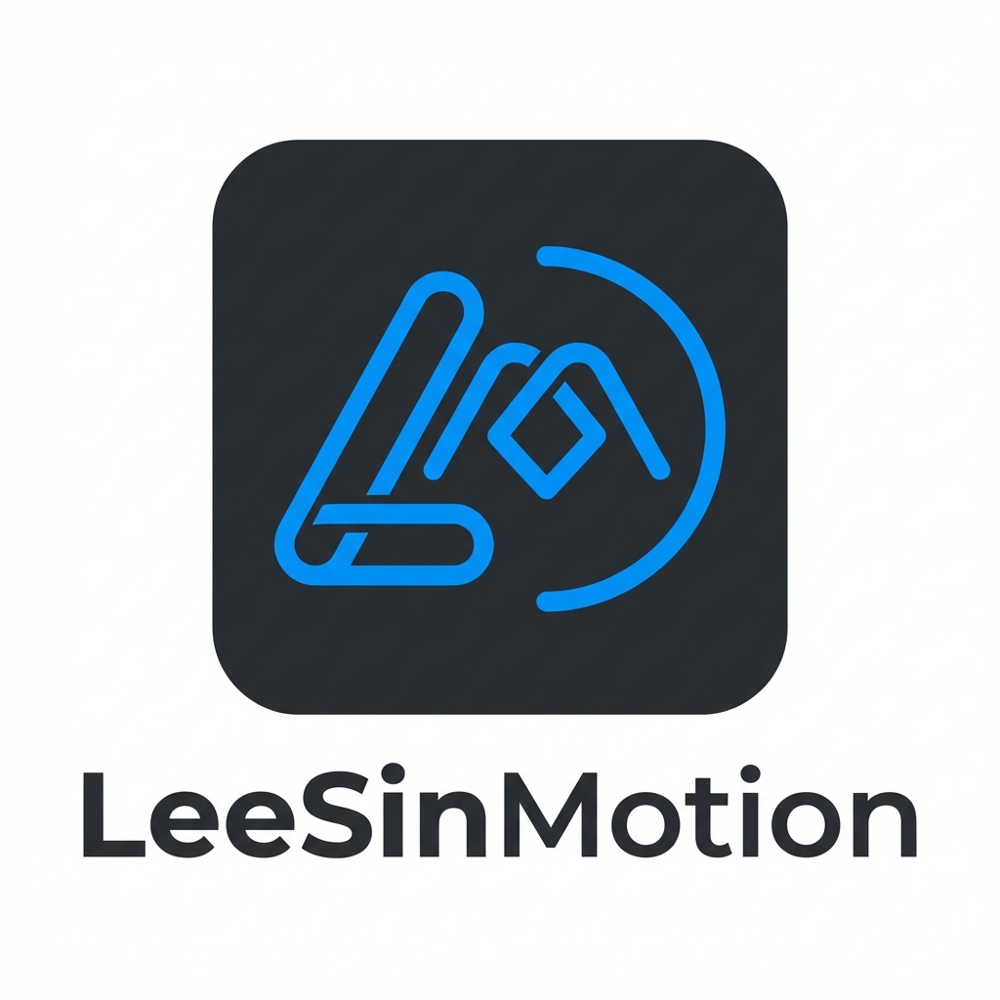

# LeeSinMotion v4.0

<div align="center">
  
  <h3>Design to Code, The Missing Bridge.</h3>
  <p>Make animation handoff painless with precise data and visual timeline specifications.</p>
  <p>
    <a href="https://leesin.peelg.com/" target="_blank">官网 Website</a> | 
    <a href="https://github.com/peelfig/LeeSinMotion/releases" target="_blank">Download v4.0</a>
  </p>
</div>

---

**LeeSinMotion 4.0** 是一次彻头彻尾的重构。它从一个简单的 ScriptUI 脚本进化为了高性能的原生 **CEP 扩展**。最重要的是，它带来了革命性的 **HTML 可视化时间轴导出**功能，彻底终结了“开发看不懂动画文档”的时代。

**LeeSinMotion 4.0** is a complete rewrite, evolved from a simple script into a high-performance **CEP Extension**. It introduces the game-changing **HTML Visual Timeline Export**, bridging the gap between motion design and engineering.

## ✨ 核心特性 (Features)

### 📊 HTML 可视化导出 (HTML Timeline Export)
一键生成独立的 `timeline.html` 文件。包含像素级精准的**可视化时间轴**、毫秒级时长标记、延迟时间和贝塞尔缓动曲线。
Generate a standalone `timeline.html` with one click. Features a pixel-perfect visual timeline, precise duration markers (ms), delays, and bezier easing curves.

### ⚡️ 原生 CEP 架构 (Native CEP)
基于 Chromium 内核重构，解析速度提升 **10 倍**。拥有现代化的 UI 界面和流畅的交互体验。
Rebuilt on Chromium. 10x faster parsing speed. Modern UI and smooth interactions.

### 🛠 完美兼容 (Full Compatibility)
支持 **After Effects CC 2014 - 2025** 全系列版本。无论是 Mac 还是 Windows，都能稳定运行。
Supports After Effects CC 2014 through 2025 (Mac & Win).

## 🚀 安装指南 (Installation)

> ⚠️ **注意**: v4.0 是扩展插件，不是脚本文件。请不要放入 Scripts 文件夹。
> **Note**: v4.0 is an Extension, not a script. Do not put it in the Scripts folder.

### 1. 下载 (Download)
前往 [Releases](https://github.com/peelfig/LeeSinMotion/releases) 下载最新的 `LeeSinMotion_v4.0.0.zip`。

### 2. 安装 (Install)
解压并将 `com.peel.leesin.motion` 文件夹移动到以下目录：
Unzip and move the `com.peel.leesin.motion` folder to:

- **macOS**:  
  `/Library/Application Support/Adobe/CEP/extensions/`
- **Windows**:  
  `C:\Program Files (x86)\Common Files\Adobe\CEP\extensions\`

### 3. 配置 (Config)
为了加载第三方插件，需要开启调试模式 (Debug Mode)：
Open Terminal (Mac) or Registry (Win) to enable PlayerDebugMode.

**Mac Terminal:**
```bash
defaults write com.adobe.CSXS.11 PlayerDebugMode 1
```
*(如果您使用旧版 AE，可能需要将 11 改为 10, 9, 8 等)*

**Windows Registry:**
Add String `PlayerDebugMode` = `1` to `HKEY_CURRENT_USER\Software\Adobe\CSXS.11`

### 4. 运行 (Run)
重启 After Effects，在菜单中打开：
Restart AE, and find it under:
**窗口 (Window) > 扩展 (Extensions) > LeeSinMotion**

## 📖 使用指南 (Usage)

1. **Scan (扫描)**: 选中关键帧，点击 `获取参数`。
2. **Copy (复制)**: 点击对应属性即可复制 CSS/贝塞尔参数。
3. **Export (导出)**: 点击底部的 `Export Timeline HTML`，生成交互文档发给开发。

## 📂 项目结构 (Project Structure)

```text
LeeSinMotion/
├── extension/                # 🧩 插件核心代码 (client, host, CSXS, package.json)
├── website/                  # 🌐 插件官网/介绍网站 (VuePress 源码)
├── docs/                     # 📖 文档中心 (贡献指南、发布记录、安装说明、图片)
├── scripts/                  # 🛠 自动化脚本 (release.sh, convert_html.py)
├── version.json              # 🔢 全局版本控制 (保留在根目录以便脚本读取)
├── README.md                 # 🏠 项目主文档
├── LICENSE.md                # ⚖️ 开源协议
└── LeeSinMotion_v4.0.0.zip   # 📦 最新稳定版安装包 (保持在根目录)
```

## ❤️ 致敬 (Credits)
Original concept by [Adam Plouff](http://www.battleaxe.co/) (Inspector Spacetime).
v3.0 - v4.0 rewrite by **peelfig**.

## 📄 协议 (License)
Apache 2.0 License.
